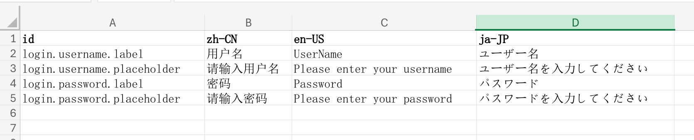

# Excel i18n Messages Generator

Generate i18n messages from an excel file.



## Installation

```bash
pnpm install
```

## Usage

### Generate locale json files

```bash
pnpm gen-locales <inputPath> <outputPath> [-f]
```

output:

`locales/zh-CN.json`

```json
{
  "login": {
    "username": {
      "label": "用户名",
      "placeholder": "请输入用户名"
    },
    "password": {
      "label": "密码",
      "placeholder": "请输入密码"
    }
  }
}
```

`locales/en-US.json`

```json
{
  "login": {
    "username": {
      "label": "UserName",
      "placeholder": "Please enter your username"
    },
    "password": {
      "label": "Password",
      "placeholder": "Please enter your password"
    }
  }
}
```

`locales/ja-JP.json`

```json
{
  "login": {
    "username": {
      "label": "ユーザー名",
      "placeholder": "ユーザー名を入力してください"
    },
    "password": {
      "label": "パスワード",
      "placeholder": "パスワードを入力してください"
    }
  }
}
```

### Generate excel file

```bash
pnpm gen-excel <inputPath> <outputPath> [-d]
```

## Todo

- [ ] nested/flat style
- [x] gen-excel
